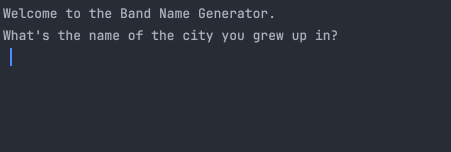

# 🐍 Day 1 - Working with Variables In Python to Manage Data

## Concepts Learned
- Printing
- String Manipulation
- Inputs
- Variables
- Variable Naming

## Functions Learned
- `print()` function for output
- `input()` function for collecting data from users 
- `len()` function 
- `+` for Concatenation
- `Cmd + /` to comment out line(s) or #
- `\n` to start a new line

## Resources Introduced
- Stack Overflow
- Thonny
- W3Schools 

## Live Demo : Band Name Generator Project 

## How to Run
1.  Run the `main.py` file.
2.  Input the name of the city you grew up in.  
3.  Input the name of your pet. 

## Output Example
Your band name could be city pet.  