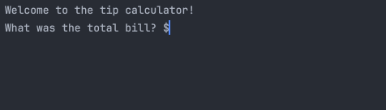

# 🐍 Day 2 - Understanding Data Types and How to Manipulate Strings

## Concepts Learned
- Data Types
- Type Error, Checking and Conversion 
- Mathematical Operations
- Number Manipulation

## Functions Learned
- `[n]` String Position 
- `type()` Type Checking
- `round()` 
- f-Strings
- `+=, -=, *=, /=` Assignment operator

## Resources Introduced
- [Python Floating Point Documentation](https://docs.python.org/3/tutorial/floatingpoint.html)

## Live Demo : Band Name Generator Project 

## How to Run
1.  Run the `main.py` file.
2.  Input the total bill amount.  
3.  Input the tip percentage (as an integer)
4.  Input the number of people to split the bill among

## Output Example
Amount each person should pay including their portion of the tip.  