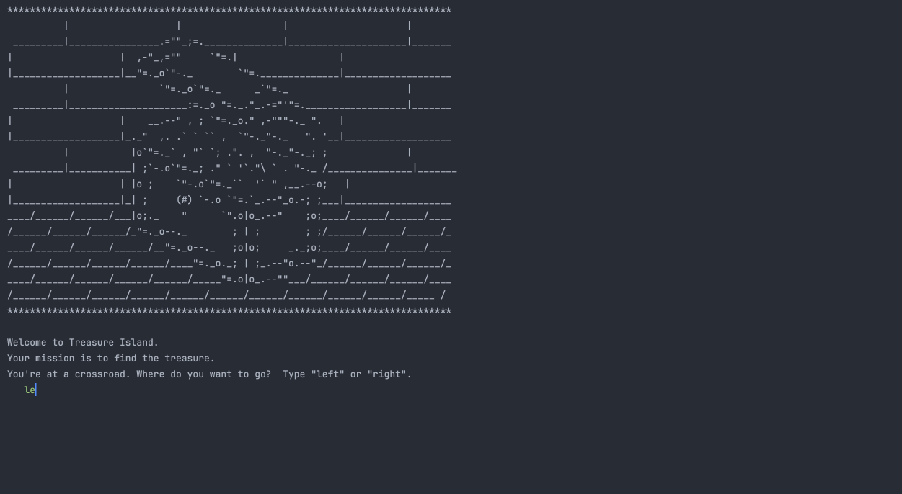

# 🖥️ Day 3 - Control Flow and Logical Operations

## Concepts Learned
- Conditional Statements - if / else
- Comparison Operators - >, <, >=, <=, ==, != 
- Modulo Operator - %
- Nested if / else Statements
- elif
- if / elif / else 
- Multiple if / else
- Logical Operators - and, or, not

## Functions Learned
- `lower()` 

## Resources Introduced
- ASCII Art - ascii.co.uk.art

## Live Demo : Treasure Island Game 

## How to Run
1.  Run the `main.py` file.
2.  Provide inputs on how you want to navigate through the game.

## Output Example
"You have entered a room full of fire!  Game Over!"