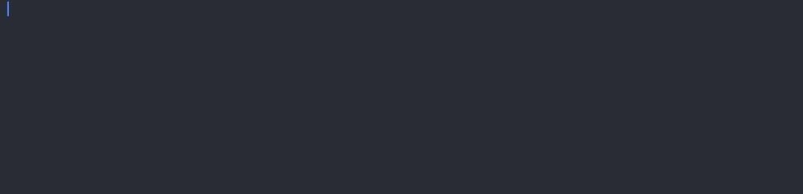

# 🐍 Day 5 - Python Loops

## Concepts Learned
- For Loops
- Looping over a List
- Looping over a Range

## Functions Learned
- `sum()`
- `max()` 
- `random.shuffle(listname)` 

## Resources Introduced
- [Carl Gauss](https://en.wikipedia.org/wiki/Carl_Friedrich_Gauss) - summing 1 to 100 as a child/student

## Live Demo : Password Generator 

## How to Run
1.  Run the `main.py` file.
2.  Input the number of letters you would like in your password.
3.  Input the number of symbols you would like in your password. 
4.  Input the number of numbers you would like in your password.  

## Output Example
Your Password is: python_generated_password