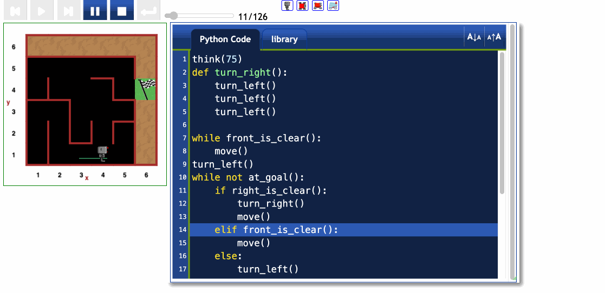

# 🐍 Day 6 - Python Loops

## Concepts Learned
- Code Blocks
- Functions
- While Loops
- Negation 
	- `while at_goal() == !True`
	- vs
	- `while not at_goal()`

## Functions Learned
- `def my_fuction()` - create your own functions
- `my_function()` - calling functions

## Resources Introduced
- [Python Built-in Functions](https://docs.python.org/3/library/functions.html)
- [Reeborg's World](https://www.udemy.com/course/100-days-of-code/learn/lecture/19110416#overview)
- [PEP 8 - Style Guide for Python Code](https://peps.python.org/pep-0008/)
- [PEP 8 - Tabs or Spaces?](https://peps.python.org/pep-0008/#tabs-or-spaces)
- Tab Setting in PyCharm - set it to 4 spaces, then you can use Tab

## Live Demo : Reboorg's World Maze Challenge 

## How to Run
1.  There is not a `main.py` file for today's project.
2.  Today's project was completed at[Reeborg's Maze Challenge](https://reeborg.ca/reeborg.html?lang=en&mode=python&menu=worlds%2Fmenus%2Freeborg_intro_en.json&name=Maze&url=worlds%2Ftutorial_en%2Fmaze1.json)
3.  Both the code and project output are maintained on that site.   

## Output Example
See Live Demo