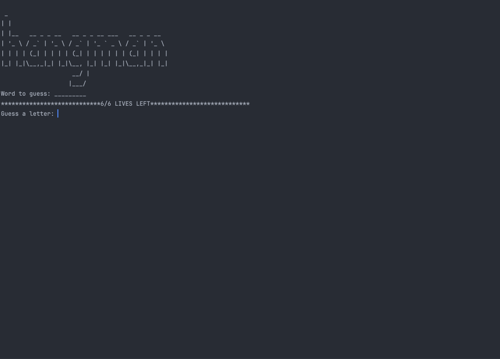

# 🐍 Day 7 - Hangman Game Project

## Concepts Learned
- For & While Loops
- if / else
- Lists 
- Strings
- Range
- Modules

## Functions Learned
- `in` keyword
- `not in` keyword

## Resources Introduced
- [Draw.io](https://app.diagrams.net/)
- [Hangman Wiki](https://en.wikipedia.org/wiki/Hangman_(game))
- [Hangman Word Game](https://hangmanwordgame.com/?fca=1&success=0#/)

## Live Demo : Hangman Game 

## How to Run
1.  Run the `main.py` file.
2.  Follow the on-screen prompts and try to guess the secret word one letter at a time.  
3.  If you guess a letter that is not in the word, an element will be added to the hangman figure.
4.  Your lives will also be reduced by 1 for each incorrect letter. 
5.  If an incorrect letter that has already been guessed, you will be reminded, no life lost.  
6.  The game will continue until the word is guess or you lose all 6 lives and the full hangman is drawn.

## Output Example
See Live Demo