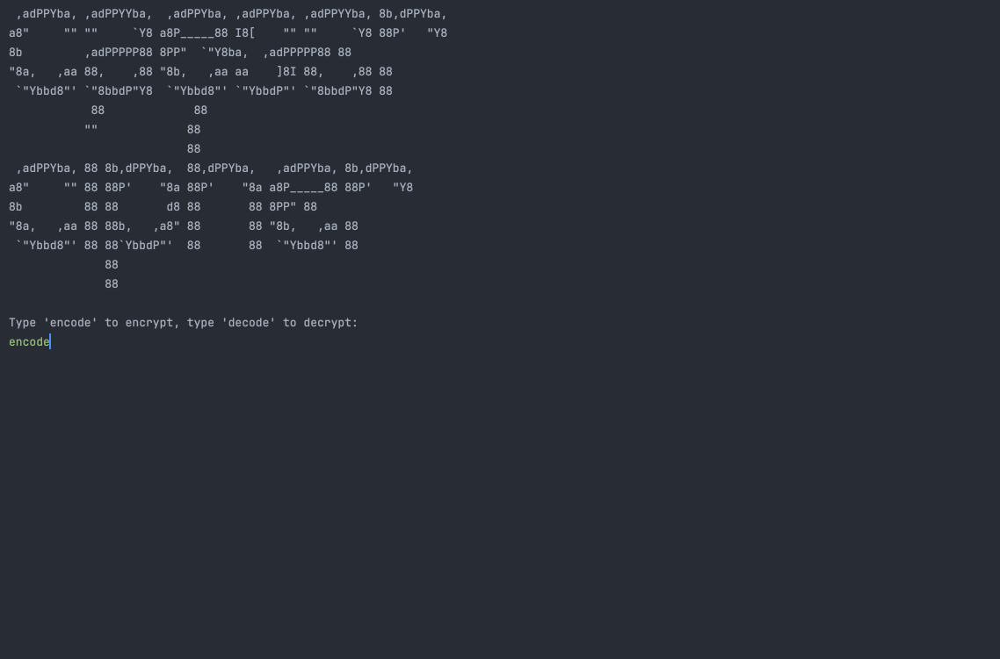

# 🐍 Day 8 - Function Parameters & Caesar Cipher

## Concepts Learned
- Functions with inputs
- Parameters
- Arguments
- Positional Arguments
- Keyword Arguments

## Functions Learned
- `count()`
- `index()` 

## Resources Introduced
- [Your life in weeks](https://waitbutwhy.com/2014/05/life-weeks.html)

## Live Demo : Caesar Cipher 

## How to Run
1.  Run the `main.py` file.
2.  Input "encode" or "decode" based on which function you wish to execute.  
3.  Input a word or phrase to encode or decode.
4.  Input the number of positions to shift your entered text.

