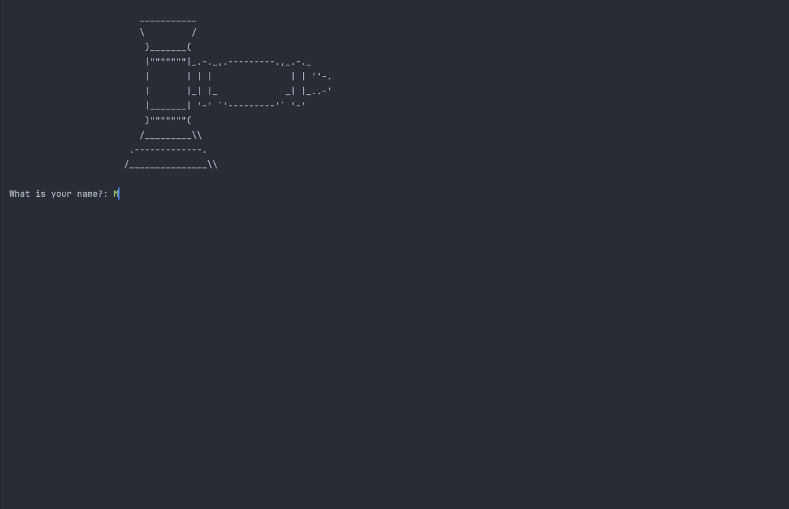

# 🐍 Day 9 - Dictionaries, Nesting and the Secret Auction

## Concepts Learned
- Dictionaries
- Key Value Pairs
- Nesting Lists 
- Nesting dictionaries
- Nesting Lists and Dictionaries in dictionaries
- Retrieving Keys from dictionaries
- Retrieving Values from dictionaries
- Looping through dictionaries
- Creating dictionaries 
- Updating dictionaries

## Functions Learned
- dictionary_name = {"key1": "value2", "key2": "value2"}
- print(dictionary[key]) to retrieve the value

## Live Demo : Secret Auction Project 

## How to Run
1.  Run the `main.py` file.
2.  Input your name and your bid amount.  
3.  If there are other bidders, answer "yes", and then pass your computer to the next bidder.
4.  If you are the final bidder, answer "no", and the program will return the winner and their bid amount. 