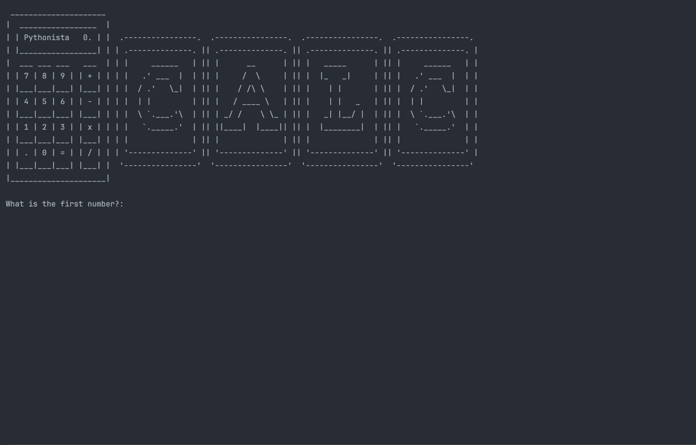

# 🐍 Day 10 - Functions with Outputs

## Concepts Learned
- return keyword - return the result of a function, for example
- output from function 1 used as input for function 2
- "return" also tells the computer "this is the end of the function"
- Nothing after "return" in a function will get executed
- return "escapes" the function
- Docstrings
- Recursion

## Functions Learned
- `title()`

## Live Demo : Calculator Project 

## How to Run
1.  Run the `main.py` file.
2.  Input your first number.   
3.  Select your mathematical operation
4.  Input your next number. 
5.  Review your result. 
6.  To use this result in additional calculations, input y, otherwise, select n