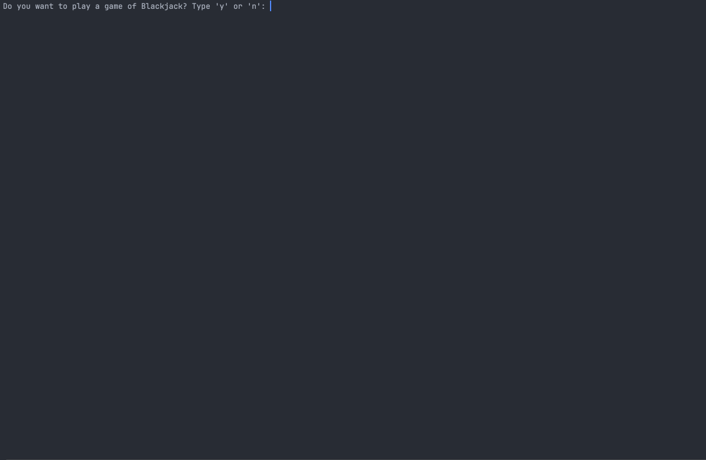

# 🐍 Day 11 - The Blackjack Capstone Project

## Concepts Learned
- The Blackjack Project is a comprehensive project covering all Python concepts learned in Day 1-10

## Functions Learned
- TThe Blackjack Project is a comprehensive project covering all Python functions learned in Day 1-10

## Live Demo : Blackjack Game 

## How to Run
1.  Run the `main.py` file.
2.  Follow the on-screen prompts.  
3.  Test your Blackjack skills and luck against the computer!  
