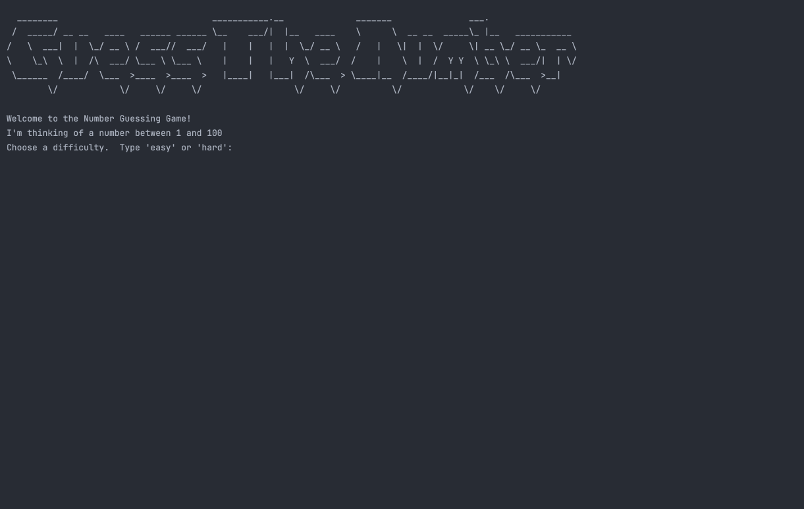

# 🐍 Day 12 - Scope & Number Guessing Game

## Concepts Learned
- Scope
- Local Scope
- Global Variables
- Namespace
- Lack of Block Scope in Python

## Functions Learned
- N/A

## Live Demo : Guess the Number Game 

## How to Run
1.  Run the `main.py` file.
2.  Select your difficulty level 
3.  You now have either 10 (easy) or 5 (hard) attempts to guess the number.  