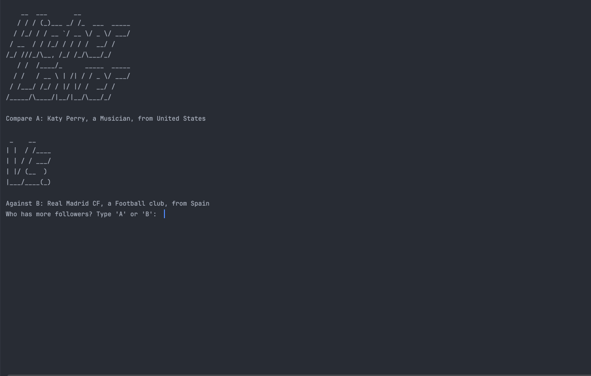

# 🐍 Day 14 - Higher Lower Game Project

## Concepts Learned
- Project covered all concepts learned to date

## Functions Learned
- N/A

## Live Demo : Higher Lower Game Project

## How to Run
1.  Run the `main.py` file.
2.  The object of the game is to guess which has more followers, A or B 
3.  If you guess correctly, then B become A and is compared to a new random B
4.  If you guess incorrectly, the game is over.  