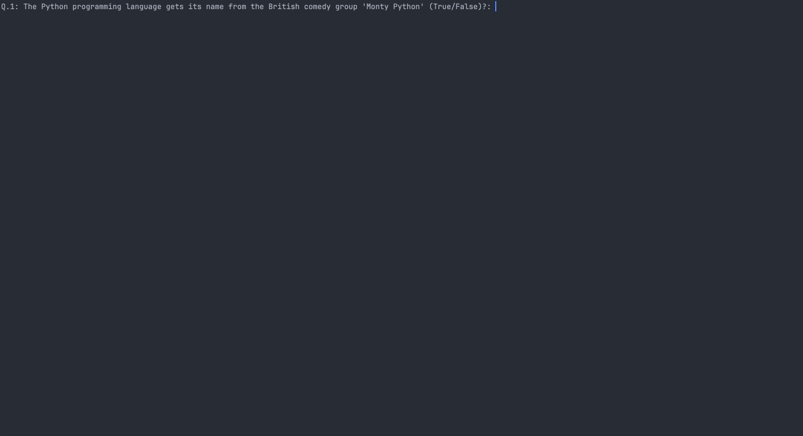

# 🐍 Day 17 - The Quiz Project & the Benefits of OOP

## Concepts Learned
- Classes
- Objects
- Constructors - aka Initializing the Object
- Init Function

## Functions, Classes, Methods, etc. Learned
- def __init__(self) # initialize attributes

## Resource Introduced 
- [Open Trivia Database](https://opentdb.com/)

## Live Demo : The Quiz Project (benefits of using OOP)

## How to Run
1.  Run the `main.py` file.
2.  Test your knowledge on a variety of subject - here we are using the Science: Computers topic. 
3.  Monitor your score as it is tracked along with correct answers being displayed. 
4.  Recieve your total score once all the questions in the bank have been asked.  