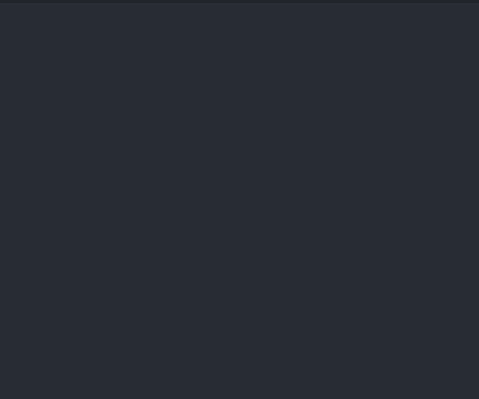

# 🐍 Day 18 - Turtle & the Graphical User Interface

## Concepts Learned
- Python Turtle Graphics Module 
- import module
- from module import class
- from module import * (not a best practice though)
- import module as alias name (Aliasing Modules)
- Installing modules
- Python Tuples
- Immutable Constructs

## Functions, Classes, Methods, etc. Learned
- `colorgram.extract(image, number_of_colors)`
- `color.rgb`
- `color.hsl`

## Resource Introduced 
- [Python Turtle Graphics Documentation ](https://docs.python.org/3/library/turtle.html)
- [trinket colors](https://trinket.io/docs/colors)
- [Turtle Colors](https://cs111.wellesley.edu/reference/colors)
- [tkinter](https://docs.python.org/3/library/tk.html)
- [Random walk](https://en.wikipedia.org/wiki/Random_walk)
- [RGB Color](https://www.w3schools.com/colors/colors_rgb.asp)
- [Python Colorgram Package](https://pypi.org/project/colorgram.py/)

## Live Demo : The Hirst Painting Project 

## How to Run
1.  Run the `main.py` file.
2.  Enjoy your randomly generated 10 x 10 dot painting inspired by [Damien Hirst](https://en.wikipedia.org/wiki/Damien_Hirst).
