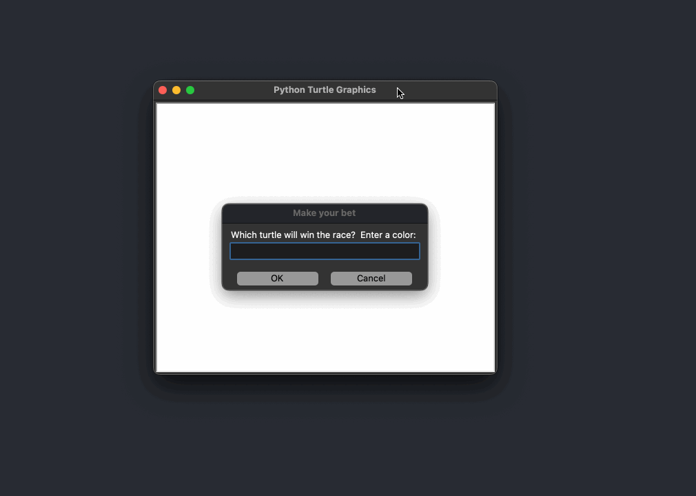

# 🐍 Day 19 - Instances, State, and Higher Order Functions

## Concepts Learned
- Turtle Screen Events
- Turtle Event Listeners
- Function as inputs to Functions
- Higher Order Functions (a function that can work within another function)
- Object State and Instance
- Turtle Coordinate System

## Functions, Classes, Methods, etc. Learned
- screen.listen(), turtle.listen()
- screen.onkey(key, function) -> ex. screen.onkey(key="space", fun=move_forwards)
- textinput(title, prompt)
- turtle.xcor(), turtle.ycor()

## Resource Introduced 
- Turtle Listen Method
- Turtle Text Input Documentation

## Live Demo : The Turtle Race Project 

## How to Run
1.  Run the `main.py` file.
2.  Place your bet by entering your pick for the color of the race winner!  
3.  Enjoy the race!  
